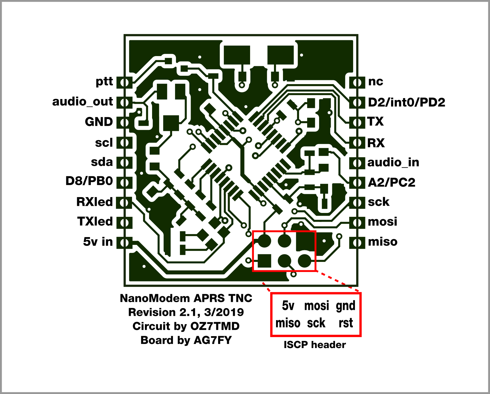
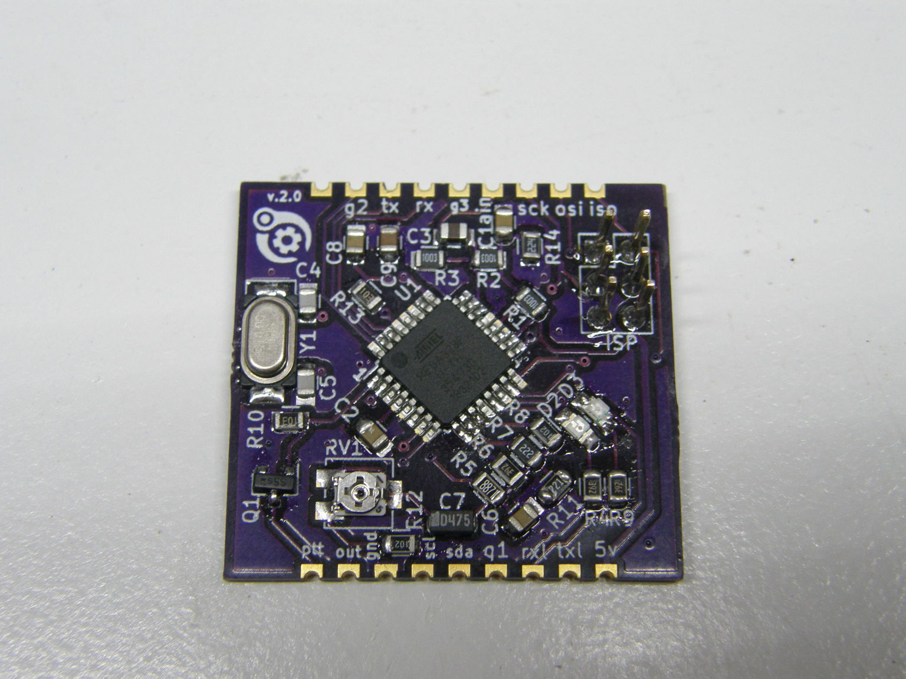

# APRS NanoModem

My PCB design for an APRS TNC, based on Mark Qvist's excellent MicroModem design. Can be used as a standalone TNC or controlled by several serial protocols. Castellated and through-hole design allows space-saving mounting on larger boards SMD style, or easy use with perfboard, breadboard, or jumper wires.

